## Overview

This document defines the **holistic SEO operation requirements** for the **GPT Breeze website** ([gptbreeze.io](http://gptbreeze.io)). It consolidates all decisions, workstreams, automation pipelines, and technical specifications agreed upon between **Trung** and **Yeh** on **17 Feb 2026**.

**How to run it (step-by-step):** see `docs/SEO-OPS-RUNBOOK.md`.

**Product:** GPT Breeze — AI productivity Chrome extension (YouTube summarizer, web page chat, custom shortcuts, BYOK)

**Domain:** [gptbreeze.io](http://gptbreeze.io)

**Stack:** Astro static site deployed via GitHub Pages (GitHub Actions)

**Codebase:** `/Users/trungluong/01_Project/GPT Breeze/gptB-website`

---

## Status Legend (Source of Truth = Repo)

- ✅ Implemented (linked to repo file)
- 🟨 Planned (not implemented in this repo yet)
- 🟥 Incorrect / remove

---

## 1. SEO Targets & KPIs

### 1.1 Primary Conversion

| Priority | Conversion Event | Tracking |
| --- | --- | --- |
| 🥇 Primary | **Chrome Web Store clicks** | ✅ GA4 event: `chrome_extension_click` (`public/js/analytics.js`) |
| 🥈 Secondary | **Engagement (scroll / time)** | ✅ GA4 events: `scroll_depth`, `engaged_session` (`public/js/analytics.js`) |
| 🥉 Optional (later) | Guide completion / newsletter signup | 🟨 Not implemented |

Note: `chrome_extension_click` currently triggers only for links matching `chrome.google.com/webstore` in `public/js/analytics.js` (some pages link to `chromewebstore.google.com`, which will not be counted until updated).

### 1.2 SEO KPIs

- **Organic signups/trials** from search
- **Branded vs non-branded traffic** split
- **Top landing pages** by organic sessions
- **Impressions → CTR** (Google Search Console)
- **Keyword cluster coverage** across target topics
- **Indexed pages** vs published pages ratio

### 1.3 Tooling Baseline

- [ ]  Google Search Console (domain property: `gptbreeze.io`)
- [ ]  Bing Webmaster Tools
- [ ]  Analytics: GA4 or Plausible
- ✅ Analytics event tracking (current): `landing_page_view`, `chrome_extension_click`, `secondary_cta_click`, `scroll_depth`, `engaged_session`, `form_submit` (`public/js/analytics.js`)
  - ✅ Source of truth: `docs/ANALYTICS_TRACKING.md`
  - 🟨 `/video/*` view / video-specific events: not implemented

---

## 3. Technical SEO Baseline

### 3.1 Existing Foundations ✅

- ✅ Astro site with `@astrojs/sitemap` enabled: `astro.config.mjs`
- ✅ Canonical base configurable via `PUBLIC_SITE`: `astro.config.mjs`
- ✅ `public/robots.txt` points to `https://gptbreeze.io/sitemap-index.xml`: `public/robots.txt`
- ✅ Global `<head>` system + `PUBLIC_NOINDEX` + `PUBLIC_CANONICAL_SITE`: `src/layouts/Base.astro`
- ✅ Content collections (**blog**, **videos**, **guide**): `src/content/config.ts`
- ✅ Blog routes + Article schema + optional FAQ schema: `src/pages/blog/[...slug].astro`
- ✅ Guide routes: `src/pages/guide/[...slug].astro`
- ✅ Video routes: `src/pages/video/[videoId].astro`
- ✅ SEO automation subsystem: `AUTONOMUS/`

### 3.2 Technical Fixes Applied ✅

- [x]  **Added `guide` collection** to `src/content/config.ts` (was missing — build blocker)
- [x]  **Fixed OG image meta tag**: `property="og:image"` (was `name="og:image"`)
- [x]  **Made OG/Twitter image URLs absolute** (helps scrapers)
- [x]  **Updated RSS branding**: "Your Blog" → "GPT Breeze Blog"
- [x]  **Fixed `.gitignore`**: added exception for `.github/workflows/*.yml`

### 3.3 Global `<head>` System Requirements

- [ ]  Title templates per page type
- [ ]  Meta description rules (unique per page, 150–160 chars)
- [ ]  Canonical URLs (self-referencing on prod)
- [ ]  OpenGraph / Twitter card tags (absolute image URLs)
- [ ]  robots meta (index/noindex based on env)

### 3.4 Structured Data (JSON-LD)

| Schema Type | Where | Status |
| --- | --- | --- |
| `SoftwareApplication` | Homepage, product pages | 🟨 Planned |
| `Organization` | Sitewide | 🟨 Planned |
| `WebSite` • `SearchAction` | Homepage | 🟨 Planned |
| `FAQPage` | Blog posts with `faq` frontmatter | ✅ Implemented (`src/pages/blog/[...slug].astro`) |
| `BreadcrumbList` | All pages | 🟨 Planned |
| `Article` | `/blog/*`, `/guide/*` | ✅ Implemented (`src/pages/blog/[...slug].astro`, `src/pages/guide/[...slug].astro`) |
| `HowTo` | `/guide/providers/*` | 🟨 Planned (currently rendered as `Article`) |

### 3.5 Indexation Policy for `/video/*` Share Pages

🟨 Planned (no per-video indexation policy implemented in this repo yet).

- If shares can expire or are private → do not auto-submit in sitemaps
- Add `noindex` when content is thin/expired or user didn't opt-in to public indexing
- JSON-LD should reflect shared content (careful with what gets indexed)

### 3.6 Performance Requirements

- Keep pages mostly static, minimal JS
- Image optimization (WebP/AVIF)
- 🟨 Hosting-specific caching headers (previously Cloudflare): planned (site currently deploys on GitHub Pages)
- Lighthouse targets: **90+** on all key pages

---

## 4. Information Architecture & Site Structure

### 4.1 URL Structure

```
/                           ← ✅ Value prop (homepage)
/pricing                    ← ✅ Pricing page
/features/*                 ← 🟨 Feature deep-dives (not implemented)
/use-cases/*                ← 🟨 Use-case playbooks (not implemented)
/compare/*                  ← 🟨 Competitor comparisons (not implemented)
/blog/*                     ← ✅ Blog articles
/guide/getting-started/     ← ✅ Onboarding guide
/guide/providers/           ← ✅ Provider hub page (pillar)
/guide/providers/<provider> ← ✅ Individual provider setup guide
/video/<videoId>            ← ✅ Shared video summaries
/privacy-first              ← ✅ Privacy page
/ai-model-cost-calculator-and-price-comparation ← ✅ Cost calculator
```

### 4.2 Keyword Cluster Map

| Cluster | Example Keywords | Target Pages |
| --- | --- | --- |
| **YouTube summarizer** | "YouTube summary", "AI video summarizer", "YouTube transcript" | `/`, `/youtube-summary`, `/blog/*` |
| **Chrome extension AI** | "AI Chrome extension", "ChatGPT Chrome extension" | `/` (🟨 `/features/*` planned) |
| **BYOK / Privacy** | "bring your own API key", "privacy-first AI" | `/privacy-first` (🟨 `/features/*` planned) |
| **Competitor comparisons** | "Eightify alternative", "HARPA AI alternative" | 🟨 `/compare/*` planned |
| **Provider setup** | "how to use Groq with GPT Breeze", "Ollama Chrome extension" | `/guide/providers/*` |
| **Meeting/video notes** | "AI meeting notes", "video notes Chrome" | 🟨 `/use-cases/*` planned, `/blog/*` |

### 4.3 SEO Money Pages (Internal Linking Targets)

All content must prioritize linking to these pages:

1. `/pricing`
2. `/youtube-summary`
3. `/privacy-first`
4. `/guide/getting-started/`
5. `/ai-model-cost-calculator-and-price-comparation`

---

## 5. Daily Automation Pipeline (AUTONOMUS)

### 5.0 Strict de-dup policy (canonical URLs)

**Decision:** One topic → one canonical URL. Avoid near-duplicate posts fighting each other.

**Implementation ✅**
- Publisher runs in strict mode: `AUTONOMUS/tools/publish-daily-post.mjs`
  - refuses duplicate slugs (no `-2/-3/-4` copies)
  - refuses publishing when topic bank is exhausted (forces backlog expansion)
- Rotation state is committed: `AUTONOMUS/state/published.jsonl`
- When a duplicate URL previously existed, it is replaced by a 301 redirect page under `src/pages/blog/*`.


### 5.1 Architecture Overview

✅ Implemented in `.github/workflows/autonomus-daily-publish.yml`.

The GitHub Actions workflow runs **daily at 01:00 Asia/Saigon** with **3 parallel-then-merge jobs**:

```mermaid
graph TD
    A["⏰ Daily Trigger (01:00 ICT)"] --> B["Job 1: Blog Post"]
    A --> C["Job 2: Provider Guide"]
    B --> D["blog.patch artifact"]
    C --> E["provider.patch artifact"]
    D --> F["Job 3: Merge + Verify + Ship"]
    E --> F
    F --> G["Apply patches"]
    G --> H["Baseline verifiers + link chores"]
    H --> I["SEO gates: npm run seo:verify + npm run check"]
    I --> J["Write daily report"]
    J --> K["Commit + push to main"]
    K --> L["Auto-deploy via GitHub Pages"]
```



### 5.2 Publishing Mode

<aside>
✅

**Decision:** Auto-merge + publish directly to main (option C). No PR review step.

</aside>

**Prerequisite:** GitHub Actions must have push access to `main` (no branch protection blocking bots).

---

## 6. Workstream 1 — Daily Blog Content Engine

### 6.1 Objective

Publish **1 blog post per day** targeting long-tail + high-intent keywords.

### 6.2 Content Templates

- "How to…" guides
- "Best … tools" listicles
- Comparison articles
- Use-case playbooks
- Glossary entries

### 6.3 Automation

| Component | File | Purpose |
| --- | --- | --- |
| Topic bank | `AUTONOMUS/content/topic-bank.json` | Queue of topics to write |
| Publisher | `AUTONOMUS/tools/publish-daily-post.mjs` | Generates markdown blog post |
| Verifier | `AUTONOMUS/tools/seo-verify.mjs` | Checks: title, pubDate, description, tags, word count, H2 count, placeholder text |

### 6.4 Quality Gates

✅ Enforced by `AUTONOMUS/tools/seo-verify.mjs` via `npm run seo:verify`:

- ✅ Title present
- ✅ `pubDate` set
- ✅ Description present (and flagged as weak if `<80 chars`)
- ✅ Tags present
- ✅ Minimum word count (blog: 650; guide: 450)
- ✅ Minimum headings (blog: 4; guide: 3; counts H2/H3)
- ✅ No placeholder text (`TODO`, `TBD`, etc.)
- ✅ `draft: true` fails

🟨 Not currently enforced by script:

- 🟨 Title templates per page type (layout-level)
- 🟨 Internal links to money pages (only minimum internal link count is enforced for blog)

### 6.5 Content File Naming (Current vs Planned)

- ✅ Current blog content lives in `src/content/blog/<slug>.md` (no enforced date prefix)
- 🟨 Planned convention: `src/content/blog/YYYY-MM-DD-slug.md` (requires a migration + updating the publisher to write date-prefixed filenames)

---

## 7. Workstream 2 — Provider Pillar Content

### 7.1 Objective

Build **topical authority** around "AI provider setup" by publishing a setup guide for every supported provider (90 total), starting with the most popular.

### 7.2 Source of Truth

| Source | Location | Purpose |
| --- | --- | --- |
| ✅ `models-api.json` | `src/data/models-api.json` | Provider inventory + example model IDs |
| 🟨 Extension source | External (extension codebase) | Actual setup flow, credential types |

### 7.3 Provider Classification

| Bucket | Providers | Setup Pattern |
| --- | --- | --- |
| **Native** | OpenAI, Anthropic, Google (Gemini), OpenRouter | Built-in credential type → paste API key |
| **OpenAI-compatible** | Groq, Together, Mistral, LM Studio, Ollama, gateways, etc. | Custom credential (`type=custom`) + base URL + API key |

### 7.4 Content Architecture

**Hub page:** `/guide/providers/` — "Supported AI Providers in GPT Breeze"

**Spoke pages:** `/guide/providers/<provider>/` — each follows this template:

1. **What it is** — 1–2 sentence description
2. **When to use it** — speed / cost / privacy positioning
3. **Step-by-step setup in GPT Breeze** — credential + model config
4. **Example model IDs** — from `models-api.json` (labeled "examples; may change")
5. **Troubleshooting** — HTTP 401, 403, 404, 429
6. **Internal links** — `/pricing`, `/ai-model-cost-calculator-and-price-comparation`, `/privacy-first`, `/guide/getting-started/`

### 7.5 On-Page SEO

- ✅ Current provider guide title pattern (generator): `How to set up <Provider> in GPT Breeze (API key + custom model)` (`AUTONOMUS/tools/publish-provider-guide.mjs`)
- ✅ Current meta description pattern (generator): “Step-by-step: add your <Provider> API credentials…” (`AUTONOMUS/tools/publish-provider-guide.mjs`)
- 🟨 Schema markup: `HowTo` structured data (currently all guides render `Article` schema in `src/pages/guide/[...slug].astro`)
- 🟨 Breadcrumb schema: `BreadcrumbList` JSON-LD (UI breadcrumbs are present, but schema is not)

### 7.6 Phase 1 Provider Queue (Priority Order)

| # | Provider | Type |
| --- | --- | --- |
| 1 | OpenAI | Native |
| 2 | Anthropic (Claude) | Native |
| 3 | Google Gemini | Native |
| 4 | OpenRouter | Native |
| 5 | Groq | OpenAI-compatible |
| 6 | Mistral | OpenAI-compatible |
| 7 | Together AI | OpenAI-compatible |
| 8 | Ollama (local + cloud) | OpenAI-compatible |
| 9 | LM Studio (local) | OpenAI-compatible |
| 10 | Vercel AI Gateway | Router |
| 11 | Cloudflare AI Gateway / Workers AI | OpenAI-compatible |
| 12 | Azure OpenAI | OpenAI-compatible |

### 7.7 Schedule

| Phase | Cadence | Scope |
| --- | --- | --- |
| **Phase 1** (Week 1–3) | **Daily** | Top 12–15 popular providers |
| **Phase 2** (Week 4+) | 1×/week | Long-tail providers + refreshes |

### 7.8 Automation Scripts

| Script | Purpose |
| --- | --- |
| `AUTONOMUS/tools/providers-index.mjs` | Parse `models-api.json` → inventory + priority queue |
| `AUTONOMUS/tools/publish-provider-guide.mjs` | Pop next provider → generate markdown → write to `src/content/guide/providers/` |
| `src/pages/guide/providers.astro` | Hub page listing all published provider guides |

---

## 8. Workstream 3 — SEO Chore Maintenance

### 8.1 A) Internal Link Maintenance (Daily)

**Why:** Internal linking is the fastest SEO lever; prevents orphan pages + improves crawl paths.

**Daily tasks:**

1. ✅ Enforce minimum internal link *count* on blog posts (default min=2): `AUTONOMUS/scripts/check_internal_links.mjs`
2. ✅ Auto-add a “Continue reading” block to low-link blog posts (best-effort, `|| true` in workflow): `AUTONOMUS/scripts/add_continue_reading.mjs`
3. 🟨 Detect broken internal links / anchors (not implemented)
4. 🟨 Enforce contextual links to “money pages” (not implemented)
5. 🟨 Reverse-linking queue automation (not implemented)

**Scripts:**

- ✅ `AUTONOMUS/scripts/check_internal_links.mjs`
- ✅ `AUTONOMUS/scripts/add_continue_reading.mjs`
- 🟨 `AUTONOMUS/scripts/internal_link_maintain.mjs` (referenced in this doc, not present in repo)

### 8.2 B) Year Rollover Updates (Monthly)

**Why:** Stale years reduce trust + CTR ("2025 guide" showing in 2026).

**Safe to auto-update (whitelist):**

- Footer copyright year
- Marketing copy with "current year" intent
- Layouts, components, pricing/home/footer pages

**Never auto-update:**

- Blog content where the year is historical or factual
- Case studies, "as of 2025" claims

**Script:** `AUTONOMUS/scripts/year_refresh.mjs` — whitelist-based, logs all diffs in report
🟨 Planned (script not present in repo)

### 8.3 C) Content Freshness Maintenance (Weekly)

**Why:** Refreshing winning pages often beats publishing net-new.

**Weekly chore — pick 1 refresh target from:**

- Older posts (>90 days)
- High-intent pages (`/youtube-summary`, `/pricing`, comparison posts)

**Refresh checklist:**

- [ ]  Tighten title + meta description
- [ ]  Add 1–2 new sections + FAQs
- [ ]  Add 3–5 internal links
- [ ]  Validate schema markup
- [ ]  Update `updatedDate` frontmatter

**Files:**

- 🟨 `AUTONOMUS/state/refresh-queue.json` — planned (not present in repo)
- 🟨 `AUTONOMUS/tools/pick-refresh-target.mjs` — planned (not present in repo)

### 8.4 D) Technical SEO Drift Checks (Daily)

- ✅ Minimal drift checks implemented in `AUTONOMUS/scripts/verify_site_basics.mjs`:
  - required files exist
  - sitemap integration is present in `astro.config.mjs`
  - `public/robots.txt` exists (warn only)
- 🟨 Not implemented (mentioned as goals):
  - validate sitemap output after build
  - validate canonical base correctness across pages
  - validate OG/Twitter tags across pages
  - detect broken internal links / 404s

**Script:** `AUTONOMUS/scripts/verify_site_basics.mjs`

---

## 9. Internal Linking Rules

<aside>
🔗

✅ Partial enforcement only (current scripts enforce a minimum internal link count on blog posts, not specific destinations or “money page” coverage).

</aside>

1. ✅ Enforced (blog): minimum internal link count (`MIN_INTERNAL_LINKS`, default 2)
2. 🟨 Planned (blog): ensure at least 1 contextual link to a “money page”
3. 🟨 Planned (guide/providers): hub links down to all provider guides + cross-links between providers
4. 🟨 Planned (blog/providers): provider mentions link to the relevant `/guide/providers/<provider>/` page

---

## 10. SEO Gate (CI/CD)

✅ Run in the daily pipeline (`.github/workflows/autonomus-daily-publish.yml`):

```
npm run check          # Astro build check
npm run seo:verify     # Blog + Guide hygiene
```

**`seo:verify` checks (blog + guide collections):**

- ✅ Title present
- ✅ `pubDate` set
- ✅ Description present (and flagged as weak if `<80 chars`)
- ✅ Tags present
- ✅ Minimum word count (blog: 650; guide: 450)
- ✅ Minimum H2/H3 headings (blog: 4; guide: 3)
- ✅ No placeholder text
- ✅ `draft` flag not true

**Optional (recommended):**

- ✅ Link checker exists (Lychee) on pushes: `.github/workflows/deploy.yml` (note: this is a general link check, not a dedicated “SEO gate” workflow)
- 🟨 Internal link + 404 detection (site-aware) gate
- [ ]  Schema validation
- [ ]  Lighthouse CI on key pages

---

## 11. Ongoing Proactive Cadence

### Weekly

- [ ]  SEO report: wins, losses, actions, next bets
- [ ]  1 content refresh target

### Monthly

- [ ]  Technical sweep: crawl checks (meta/canonicals/404s/redirects)
- [ ]  Lighthouse audit on key pages
- [ ]  Sitemap sanity check
- [ ]  Schema validation
- [ ]  Year rollover check (whitelist)

### Quarterly

- [ ]  Backlink/PR targets: list of 20–50 relevant sites + outreach angle
- [ ]  Keyword cluster coverage review
- [ ]  Competitor comparison gap analysis

---

## 12. Content Templates Library

| Template | Use Case | Target Intent |
| --- | --- | --- |
| "How to…" | Setup guides, tutorials | Informational |
| "Best … tools" | Listicles | Commercial investigation |
| "X vs Y" Comparison | Competitor pages | Transactional |
| Use-case playbooks | Workflow guides | Informational → Transactional |
| Glossary | Definition pages | Informational (top-of-funnel) |
| Provider setup guide | Provider-specific BYOK setup | Informational → Transactional |

---

## 13. Reporting

**Daily report:** `AUTONOMUS/reports/YYYY-MM-DD.md`

- ✅ Daily report file is created/appended by the workflow: `.github/workflows/autonomus-daily-publish.yml`
- 🟨 Planned: include detailed shipped URLs, internal-link diffs, and warnings (current report content is minimal)

**Summary posted to:** 🟨 Planned (Telegram integration not implemented)

---

## 14. Success Metrics

| Metric | Target | Measurement Tool |
| --- | --- | --- |
| Provider guides published (Phase 1) | **12 guides in ~2 weeks** | Count in `/guide/providers/` |
| Blog posts published | **1 per day** | Count in `/blog/` |
| Organic impressions on provider keywords | **+50% within 30 days** of Phase 1 | Google Search Console |
| CTR to `/pricing` from content pages | **>5%** | 🟨 Planned (no dedicated `/pricing` click event implemented) |
| Indexed pages in Google | **100% of published** within 7 days | GSC Coverage report |
| Hub page ranking for "GPT Breeze supported providers" | **Top 10 within 60 days** | GSC / Ahrefs |
| Daily pipeline success rate | **>95%** | GitHub Actions logs |

---

## 15. Files Changed (Summary)

### Applied on main (17 Feb 2026)

- `src/content/config.ts` — added guide collection
- `src/layouts/Base.astro` — canonical/noindex controls + OG fix
- `src/pages/rss.xml.js` — RSS branding
- `.gitignore` — allow `.github/workflows`
- `.github/workflows/autonomus-daily-publish.yml` — daily 3-job pipeline
- `AUTONOMUS/tools/seo-verify.mjs` — upgraded for blog + guide
- `AUTONOMUS/tools/providers-index.mjs` — new
- `AUTONOMUS/tools/publish-provider-guide.mjs` — new
- `src/pages/guide/providers.astro` — new hub page
- `AUTONOMUS/plan.md` — updated
- `AUTONOMUS/plans/provider-pillar.md` — new

### Deleted

- Beta branch + `deploy-beta.yml` workflow

---

## 16. Open Decisions & Next Steps

- [ ]  **Business priority reorder:** Confirm top 5 providers by revenue/user priority (may override popularity-based queue)
- [ ]  **FAQ sourcing:** Where will troubleshooting FAQs come from? Extension support tickets? Community feedback?
- [ ]  **Image/video assets:** Do provider guides need screenshots or video walkthroughs?
- [ ]  **Backlink strategy:** Define initial outreach angle (data page, free tool, stats)
- [ ]  **Programmatic SEO:** Evaluate scalable "use case" / "workflow" pages once content engine matures
- [ ]  **Comparison pages:** Prioritize which competitor comparisons to build first (`/compare/*`)
